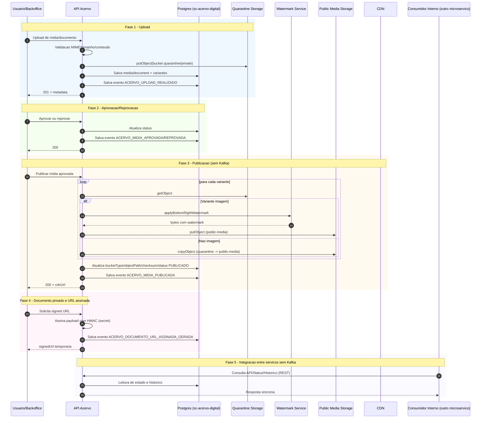

# Documentação Negocial — API Acervo Digital

**Plataforma:** Via Fluvial  
**Microsserviço:** `api-acervo-digital`  
**Domínio / Bounded Context:** `acervo-digital`  
**Versão:** 1.0  
**Objetivo do documento:** definir, do ponto de vista de negócio, o escopo, comportamento, decisões, regras e responsabilidades do domínio de Acervo Digital da plataforma Via Fluvial.

---

## 1. Visão Geral do Domínio

O domínio de **Acervo Digital** é responsável por controlar todos os arquivos digitais vinculados à operação da plataforma Via Fluvial.

Esse domínio cobre, principalmente:

- imagens de barcos;
- imagens de acomodações;
- vídeos de barcos e acomodações;
- imagens institucionais e de marketing;
- vídeos promocionais;
- documentos de barqueiros;
- documentos de embarcações;
- termos, autorizações, normas e comprovantes;
- aprovação administrativa de mídias;
- controle de publicação em CDN;
- controle de acesso a documentos privados;
- rastreabilidade do ciclo de vida dos arquivos.

O Acervo Digital existe para garantir que a plataforma não trate arquivos apenas como upload simples, mas como ativos digitais controlados, aprovados, rastreáveis e vinculados corretamente ao negócio.

---

## 2. Justificativa de Negócio

A plataforma Via Fluvial depende fortemente de imagens, vídeos e documentos para gerar confiança entre passageiros, barqueiros, agências e administradores.

As fotos e vídeos dos barcos e acomodações impactam diretamente:

- a experiência do passageiro;
- a decisão de compra;
- a credibilidade do barqueiro;
- a qualidade do fluxo de venda;
- a comunicação visual da plataforma;
- o uso em campanhas de marketing;
- o material institucional e comercial da Via Fluvial.

Além disso, documentos de barqueiros e embarcações são essenciais para:

- validação cadastral;
- controle operacional;
- compliance;
- segurança da operação;
- análise administrativa;
- registro de autorizações e responsabilidades.

Por isso, o Acervo Digital deve possuir regras próprias de negócio, e não ser tratado como uma funcionalidade secundária dentro de outros microsserviços.

---

## 3. Decisão de Negócio: Microsserviço Próprio

A decisão recomendada é implementar o Acervo Digital como um microsserviço próprio:

```text
api-acervo-digital
```

Essa decisão existe porque o acervo é usado por vários domínios da plataforma, mas possui regras próprias que não pertencem exclusivamente a nenhum deles.

O Acervo Digital não é apenas parte de embarcações, nem apenas parte de compliance, nem apenas parte de administração. Ele é um domínio transversal, com controle próprio sobre arquivos, status, aprovação, publicação, privacidade e rastreabilidade.

### 3.1 Por que não pulverizar nos 18 microsserviços

Não se recomenda distribuir upload, aprovação, documentos e CDN entre vários microsserviços.

Pulverizar essa responsabilidade causaria:

- duplicidade de regras de upload;
- duplicidade de validação de arquivos;
- múltiplos padrões de aprovação;
- dificuldade para saber qual mídia está publicada;
- risco de publicar conteúdo sem aprovação;
- dificuldade de rastrear quem aprovou ou reprovou;
- inconsistência entre documentos públicos e privados;
- maior risco de vazamento de documentos;
- dependência excessiva entre domínios;
- manutenção mais difícil.

Portanto, a regra de negócio é:

> Todo arquivo digital relevante da plataforma deve ser registrado, controlado e governado pelo domínio Acervo Digital.

---

## 4. Responsabilidade do Acervo Digital

O microsserviço `api-acervo-digital` é responsável por controlar o ciclo de vida dos arquivos digitais.

Suas responsabilidades de negócio são:

- receber arquivos enviados pela plataforma;
- classificar arquivos conforme finalidade e visibilidade;
- vincular arquivos a entidades de negócio;
- manter arquivos pendentes em quarentena;
- impedir publicação automática de mídia enviada por barqueiro;
- submeter imagens e vídeos à aprovação administrativa;
- registrar aprovação, reprovação e motivo;
- liberar mídia pública somente após aprovação;
- controlar documentos privados;
- permitir acesso controlado a documentos;
- manter histórico de alterações relevantes;
- registrar metadados dos arquivos;
- controlar direitos de uso de imagem e mídia;
- controlar validade de documentos, quando aplicável;
- informar outros domínios sobre status da mídia ou documento quando consultado.

---

## 5. O que não compete ao Acervo Digital

O Acervo Digital não deve assumir regras de outros domínios.

Não compete a este microsserviço:

- cadastrar barqueiro;
- cadastrar agência;
- cadastrar embarcação;
- definir capacidade de barco;
- definir rota ou porto;
- criar viagem;
- vender passagem;
- calcular tarifa;
- processar pagamento;
- autenticar usuário;
- definir política comercial;
- emitir relatório financeiro;
- substituir o domínio de compliance;
- substituir o domínio de administração.

O Acervo Digital pode guardar arquivos vinculados a essas entidades, mas não deve ser o dono da regra principal dessas entidades.

Exemplo:

- `api-embarcacoes` é dono do cadastro do barco;
- `api-acervo-digital` é dono das imagens e documentos vinculados ao barco.

---

## 6. Entidades de Negócio Relacionadas

O Acervo Digital deve permitir vínculo de arquivos com diferentes entidades da plataforma.

Principais vínculos previstos:

| Entidade | Exemplos de uso no acervo |
|---|---|
| Barqueiro | documentos cadastrais, contrato social, autorizações |
| Embarcação | fotos, vídeos, documentos da embarcação, vistorias |
| Acomodação | imagens e vídeos de camarote, suíte, rede, banheiro, deck |
| Agência | documentos e materiais institucionais, quando aplicável |
| Campanha | imagens e vídeos de marketing |
| Site | banners, imagens institucionais, imagens de destinos |
| Administração | arquivos internos, termos, comprovantes, anexos administrativos |

---

## 7. Tipos de Arquivos Controlados

O Acervo Digital deve controlar diferentes tipos de arquivos.

### 7.1 Imagens

Usadas para:

- fotos de barcos;
- fotos de acomodações;
- fotos de áreas internas;
- fotos de áreas externas;
- imagens de capa;
- banners;
- cards de venda;
- imagens de marketing;
- imagens para site;
- imagens para apresentações.

### 7.2 Vídeos

Usados para:

- apresentação do barco;
- demonstração das acomodações;
- vídeos curtos do ambiente interno;
- vídeos promocionais;
- vídeos institucionais;
- vídeos para campanhas.

### 7.3 Documentos

Usados para:

- documentos do barqueiro;
- documentos da empresa;
- documentos da embarcação;
- vistorias;
- licenças;
- normas;
- autorizações;
- contratos;
- termos de responsabilidade;
- autorizações de uso de imagem;
- documentos exigidos pela plataforma.

---

## 8. Classificação por Visibilidade

Todo item do acervo deve possuir classificação de visibilidade.

| Visibilidade | Descrição | Exemplo |
|---|---|---|
| Pública | Pode ser exibida aos passageiros após aprovação | foto do barco, vídeo da acomodação |
| Privada | Acesso restrito a usuários autorizados | documento da embarcação, contrato social |
| Interna | Uso administrativo da plataforma | parecer, observação, anexo interno |
| Restrita | Acesso limitado por perfil ou finalidade específica | autorização, documento sensível, termo jurídico |

Regra principal:

> Documentos privados nunca devem ser publicados em CDN pública.

---

## 9. Classificação por Finalidade

Todo arquivo deve ter uma finalidade de negócio.

Finalidades esperadas:

- `VENDA`;
- `GALERIA`;
- `MARKETING`;
- `SITE`;
- `SLIDE`;
- `CADASTRO`;
- `COMPLIANCE`;
- `CONTRATUAL`;
- `OPERACIONAL`;
- `ADMINISTRATIVO`.

A finalidade define como o arquivo poderá ser usado.

Exemplo:

Uma foto aprovada para galeria do barco não deve ser automaticamente usada em campanha de marketing, salvo se houver autorização específica para isso.

---

## 10. Ciclo de Vida de uma Mídia Pública

Mídia pública é qualquer imagem ou vídeo que poderá aparecer para passageiros, no site, no fluxo de venda ou em materiais comerciais.

Fluxo principal:

```text
Upload → Quarentena → Análise Administrativa → Aprovação ou Reprovação → Publicação → Exibição
```

### 10.1 Upload

O barqueiro, agência ou usuário autorizado envia uma imagem ou vídeo.

Nesse momento:

- a mídia não deve ficar pública;
- a mídia não deve ir diretamente para CDN;
- a mídia deve ser registrada como pendente;
- a mídia deve ficar vinculada ao proprietário, barco, acomodação ou finalidade correspondente.

### 10.2 Quarentena

Todo conteúdo enviado por usuário externo deve ficar inicialmente em quarentena.

A quarentena representa que o arquivo existe, mas ainda não foi validado pela administração da plataforma.

### 10.3 Análise Administrativa

A administração deve revisar a mídia antes da publicação.

A análise deve verificar, no mínimo:

- se a imagem ou vídeo corresponde ao barco informado;
- se não há conteúdo inadequado;
- se não há exposição indevida de pessoas;
- se não há risco evidente de violação de direito de imagem;
- se não há risco evidente de violação de direito autoral;
- se a qualidade visual é minimamente aceitável;
- se a mídia está vinculada à categoria correta;
- se a finalidade informada é compatível com o conteúdo.

### 10.4 Aprovação

Ao aprovar, a administração autoriza a publicação da mídia conforme a finalidade definida.

A aprovação deve registrar:

- quem aprovou;
- quando aprovou;
- qual item foi aprovado;
- qual finalidade foi aprovada;
- qual visibilidade foi autorizada.

### 10.5 Reprovação

Ao reprovar, a administração deve informar motivo.

Motivos comuns:

- imagem de baixa qualidade;
- conteúdo não corresponde ao barco;
- conteúdo inadequado;
- presença de pessoa sem autorização;
- suspeita de direito autoral;
- duplicidade;
- documento/mídia ilegível;
- arquivo incorreto;
- categoria incorreta.

### 10.6 Publicação

Somente mídia aprovada pode ser publicada.

A publicação torna a mídia disponível para uso na plataforma, conforme sua finalidade.

### 10.7 Diagrama de sequência das fases



---

## 11. Status de Negócio

O Acervo Digital deve controlar status claros.

Status sugeridos:

| Status | Significado |
|---|---|
| `RASCUNHO` | Item criado, mas ainda não enviado definitivamente |
| `ENVIADO` | Arquivo recebido pela plataforma |
| `EM_QUARENTENA` | Arquivo armazenado, mas não analisado |
| `AGUARDANDO_APROVACAO` | Item pendente de análise administrativa |
| `APROVADO` | Item aprovado pela administração |
| `REPROVADO` | Item recusado pela administração |
| `PUBLICADO` | Item aprovado e disponível para uso público ou operacional |
| `BLOQUEADO` | Item impedido de uso por regra administrativa, jurídica ou operacional |
| `ARQUIVADO` | Item mantido apenas para histórico |
| `REMOVIDO` | Item removido logicamente da plataforma |
| `EXPIRADO` | Documento ou autorização perdeu validade |

Regra principal:

> Somente itens com status `PUBLICADO` podem aparecer no site, fluxo de venda ou CDN pública.

---

## 12. Regra de Publicação

A publicação deve obedecer às seguintes condições:

- o item deve estar aprovado;
- a finalidade deve permitir publicação;
- a visibilidade deve ser pública;
- não deve haver bloqueio administrativo;
- não deve haver pendência de direito de uso, quando aplicável;
- não deve haver documento obrigatório pendente, se a regra do negócio exigir.

A publicação não é apenas mover arquivo. Ela representa uma decisão de negócio.

---

## 13. Controle de Direito de Uso

O Acervo Digital deve controlar se uma mídia pode ser usada pela plataforma.

Esse controle é importante porque imagens e vídeos podem conter:

- pessoas identificáveis;
- áreas privadas;
- marcas de terceiros;
- músicas;
- elementos protegidos por direito autoral;
- material produzido por terceiros.

### 13.1 Regras de direito de uso

Para cada mídia, deve ser possível registrar:

- origem da mídia;
- quem enviou;
- se o barqueiro declara possuir direito de uso;
- se pode ser usada na galeria;
- se pode ser usada no fluxo de venda;
- se pode ser usada no site;
- se pode ser usada em marketing;
- se pode ser usada em redes sociais;
- se pode ser usada em apresentações;
- validade da autorização, se houver;
- documento de autorização vinculado, quando necessário.

### 13.2 Origem da mídia

Origens possíveis:

- enviada pelo barqueiro;
- enviada por agência;
- produzida pela Via Fluvial;
- produzida por fotógrafo contratado;
- recebida de terceiro autorizado;
- banco de imagem licenciado.

---

## 14. Termo de Responsabilidade de Upload

Antes de enviar mídias, o barqueiro ou responsável deve aceitar termo declarando que:

- possui direito de uso da imagem ou vídeo enviado;
- o conteúdo corresponde ao barco ou serviço informado;
- o conteúdo não viola direito de terceiros;
- o conteúdo não contém informação falsa;
- autoriza a plataforma a usar a mídia conforme a finalidade selecionada;
- entende que a plataforma pode reprovar, bloquear ou remover a mídia.

Esse aceite deve ser registrado como evidência de negócio.

---

## 15. Autorização de Uso de Imagem

Quando uma imagem ou vídeo contiver pessoa identificável, pode ser necessário registrar autorização de uso de imagem.

A plataforma deve permitir associar uma autorização a uma mídia.

Exemplos:

- passageiro aparecendo em vídeo promocional;
- tripulante identificado em foto;
- família aparecendo em foto de acomodação;
- pessoa reconhecível em material de marketing.

Regra recomendada:

> Mídias com pessoas identificáveis não devem ser usadas para marketing amplo sem autorização específica.

---

## 16. Documentos do Barqueiro

O Acervo Digital deve armazenar e controlar documentos vinculados ao barqueiro.

Exemplos:

- CNPJ;
- CPF, quando aplicável;
- contrato social;
- comprovante cadastral;
- procuração;
- autorização de operação;
- documentos de representação;
- termo de responsabilidade;
- termo de aceite da plataforma;
- autorização de uso de mídia.

Esses documentos são privados e não devem ficar disponíveis publicamente.

---

## 17. Documentos da Embarcação

O Acervo Digital deve armazenar documentos relacionados ao barco.

Exemplos:

- documento da embarcação;
- inscrição ou registro;
- licença;
- autorização;
- vistoria;
- seguro;
- norma de segurança;
- documento operacional;
- certificado;
- comprovação de capacidade;
- anexos exigidos pela plataforma.

A existência e validade desses documentos podem impactar a disponibilidade do barco para venda.

---

## 18. Controle de Validade Documental

Alguns documentos podem possuir data de validade.

O Acervo Digital deve registrar:

- data de emissão;
- data de validade;
- órgão emissor, quando aplicável;
- número do documento, quando aplicável;
- status do documento;
- data de aprovação;
- responsável pela análise.

Status documentais possíveis:

- `PENDENTE`;
- `EM_ANALISE`;
- `APROVADO`;
- `REPROVADO`;
- `VENCIDO`;
- `SUBSTITUIDO`;
- `ARQUIVADO`.

Regra recomendada:

> Documentos obrigatórios vencidos ou reprovados podem bloquear a publicação ou comercialização do barco, conforme regra definida pelo domínio responsável pela operação.

---

## 19. Relação com Compliance

O Acervo Digital armazena e controla os documentos, mas não deve assumir sozinho todas as decisões de compliance.

A separação recomendada é:

- Acervo Digital: guarda, classifica, disponibiliza e registra status do documento;
- Compliance: interpreta pendências, exigências e conformidade operacional;
- Administração: aprova, reprova ou solicita correção, conforme perfil autorizado.

O Acervo Digital deve fornecer informações confiáveis para que o compliance tome decisões.

---

## 20. Relação com Embarcações

O domínio de Embarcações é dono das regras sobre barcos, capacidade, acomodação e características operacionais.

O Acervo Digital é dono das mídias e documentos vinculados a essas embarcações.

Exemplos:

- Embarcações cadastra o barco `Barco Estrela do Amazonas`;
- Acervo Digital armazena a foto da suíte desse barco;
- Embarcações define a acomodação `camarote`;
- Acervo Digital vincula imagens e vídeos à acomodação `camarote`.

---

## 21. Relação com Administração

A administração da plataforma deve possuir funcionalidades para:

- listar mídias pendentes;
- visualizar prévia de imagens;
- visualizar prévia de vídeos;
- consultar documentos enviados;
- aprovar mídias;
- reprovar mídias;
- aprovar documentos;
- reprovar documentos;
- informar motivo de reprovação;
- bloquear mídia publicada;
- remover mídia da exibição pública;
- consultar histórico de ações.

A tela administrativa pode estar em outro frontend, mas a regra de aprovação pertence ao Acervo Digital.

---

## 22. Relação com Marketing e Site

A plataforma poderá usar imagens e vídeos em marketing, campanhas, banners, redes sociais e site institucional.

O Acervo Digital deve permitir diferenciar:

- mídia aprovada para galeria do barco;
- mídia aprovada para venda;
- mídia aprovada para marketing;
- mídia aprovada para redes sociais;
- mídia aprovada para apresentação interna.

Regra importante:

> Aprovar uma mídia para aparecer no barco não significa automaticamente aprovar seu uso em campanha publicitária.

---

## 23. Regra de Exibição no Fluxo de Venda

O fluxo de venda deve exibir somente mídias publicadas.

Condições mínimas:

- mídia com status `PUBLICADO`;
- vinculada ao barco ou acomodação correta;
- finalidade compatível com venda ou galeria;
- visibilidade pública;
- sem bloqueio administrativo;
- com URL pública/CDN disponível.

O fluxo de venda não deve consultar diretamente buckets privados ou quarentena.

---

## 24. Imagem Principal do Barco

O Acervo Digital deve permitir indicar uma imagem principal para o barco.

Regras:

- somente imagem aprovada pode ser definida como principal;
- somente uma imagem principal ativa por barco deve existir por contexto, quando aplicável;
- a imagem principal pode ser usada em cards, listagens e resultados de busca;
- se a imagem principal for bloqueada ou removida, o barco deve ficar sem imagem principal ou escolher outra aprovada.

---

## 25. Múltiplas Versões de Imagem

Uma mesma imagem pode possuir variações para diferentes usos.

Exemplos:

- original;
- thumbnail;
- card;
- galeria;
- banner;
- slide.

Do ponto de vista de negócio, essas versões representam o mesmo item de mídia, adaptado para contextos diferentes.

A aprovação é do item de mídia, não necessariamente de cada variação técnica, salvo decisão futura.

---

## 26. Vídeos

Vídeos devem ter controle mais rigoroso que imagens, porque podem envolver áudio, pessoas, marcas, ambientes e maior custo de armazenamento/publicação.

Regras recomendadas:

- todo vídeo enviado por barqueiro deve passar por aprovação;
- vídeos não aprovados não devem ser publicados;
- vídeos com pessoas identificáveis devem exigir avaliação adicional;
- vídeos com música ou narração de terceiros devem exigir atenção a direito autoral;
- a plataforma pode limitar tamanho, duração e formato;
- a plataforma pode remover ou bloquear vídeo já publicado se houver risco jurídico, comercial ou reputacional.

---

## 27. Documentos Privados

Documentos privados devem ter tratamento diferente de mídias públicas.

Regras:

- não são publicados em CDN pública;
- não aparecem para passageiros;
- não devem ser acessados sem autenticação/autorização;
- devem ter rastreabilidade de envio e análise;
- podem ter validade;
- podem ser substituídos;
- podem ser arquivados;
- podem ser usados como evidência administrativa.

---

## 28. Auditoria de Negócio

O Acervo Digital deve registrar eventos relevantes do domínio.

Eventos auditáveis:

- upload realizado;
- mídia enviada para análise;
- mídia aprovada;
- mídia reprovada;
- mídia publicada;
- mídia bloqueada;
- mídia removida;
- documento enviado;
- documento aprovado;
- documento reprovado;
- documento substituído;
- documento vencido;
- autorização vinculada;
- alteração de finalidade;
- alteração de visibilidade;
- geração de acesso a documento privado.

Cada evento deve registrar, quando aplicável:

- ator;
- data/hora;
- entidade afetada;
- resultado;
- motivo;
- identificador de correlação;
- metadados mínimos.

---

## 29. Perfis e Permissões de Negócio

Perfis esperados:

| Perfil | Permissões de negócio |
|---|---|
| Passageiro | Visualiza apenas mídia pública publicada |
| Barqueiro | Envia mídias e documentos próprios, acompanha status |
| Agência | Envia mídias e documentos de barcos sob sua gestão, quando autorizado |
| Administrador | Aprova, reprova, publica, bloqueia e remove itens |
| Suporte | Consulta status e orienta usuários, conforme permissão |
| Compliance | Analisa documentos, pendências e validade |
| Marketing | Consulta mídias permitidas para campanhas e solicita uso |

Regra principal:

> Nenhum usuário externo deve conseguir publicar mídia diretamente sem aprovação administrativa.

---

## 30. Motivos Padronizados de Reprovação

A plataforma deve possuir motivos padronizados para reprovação, permitindo relatório e melhoria operacional.

Motivos sugeridos para mídia:

- `BAIXA_QUALIDADE`;
- `CONTEUDO_INADEQUADO`;
- `NAO_CORRESPONDE_A_EMBARCACAO`;
- `DIREITO_IMAGEM_PENDENTE`;
- `DIREITO_AUTORAL_PENDENTE`;
- `PESSOA_IDENTIFICAVEL_SEM_AUTORIZACAO`;
- `ARQUIVO_CORROMPIDO`;
- `DUPLICADO`;
- `CATEGORIA_INCORRETA`;
- `OUTRO`.

Motivos sugeridos para documento:

- `ILEGIVEL`;
- `DOCUMENTO_INVALIDO`;
- `DOCUMENTO_VENCIDO`;
- `DOCUMENTO_INCOMPLETO`;
- `DOCUMENTO_NAO_CORRESPONDE_A_ENTIDADE`;
- `DADOS_INCONSISTENTES`;
- `ARQUIVO_CORROMPIDO`;
- `OUTRO`.

---

## 31. Remoção e Bloqueio

A remoção de um item do acervo deve ser tratada com cuidado.

Tipos de remoção:

- remoção lógica;
- arquivamento;
- bloqueio administrativo;
- substituição por nova versão;
- expiração por validade.

Regra recomendada:

> Itens aprovados ou publicados não devem ser apagados fisicamente de forma imediata sem critério de retenção definido.

---

## 32. Retenção de Arquivos

A plataforma deve definir política de retenção.

Sugestões:

- mídia reprovada pode ser mantida por prazo limitado;
- documentos substituídos podem ser mantidos para histórico;
- documentos vencidos podem ser arquivados;
- arquivos removidos podem ser mantidos por período de segurança;
- arquivos de quarentena abandonados podem ser descartados após prazo configurado.

Essa política deve considerar necessidade operacional, jurídica e de privacidade.

---

## 33. Regras para Quarentena

A quarentena é o estado inicial de proteção da plataforma.

Regras:

- todo upload externo entra em quarentena;
- quarentena não é pública;
- quarentena não deve alimentar o site;
- quarentena não deve alimentar fluxo de venda;
- quarentena deve ser visível apenas para perfis autorizados;
- itens em quarentena devem possuir prazo ou fila de análise.

---

## 34. Regras para CDN

A CDN deve receber somente conteúdo público aprovado.

Regras:

- documentos privados não vão para CDN;
- quarentena não vai para CDN;
- mídia reprovada não vai para CDN;
- mídia bloqueada deve deixar de ser exibida;
- URLs públicas devem ser usadas apenas para conteúdo publicável.

---

## 35. Metadados Obrigatórios

Cada item do acervo deve possuir metadados mínimos.

Metadados sugeridos:

- identificador público;
- tipo do item;
- finalidade;
- visibilidade;
- status;
- entidade vinculada;
- proprietário vinculado;
- barco vinculado, quando aplicável;
- acomodação vinculada, quando aplicável;
- usuário que enviou;
- data de envio;
- usuário que aprovou/reprovou;
- data da aprovação/reprovação;
- motivo de reprovação, quando aplicável;
- caminho do arquivo;
- URL pública, quando aplicável;
- tipo MIME;
- tamanho;
- hash/checksum;
- validade, quando aplicável.

---

## 36. Identificadores Públicos

A plataforma deve usar identificadores públicos para compor caminhos e URLs.

Não usar CPF ou CNPJ em:

- nome de bucket;
- URL pública;
- caminho de objeto;
- path de CDN;
- nome de arquivo;
- logs públicos.

Usar identificadores como:

- `ownerPublicKey`;
- `boatPublicKey`;
- `mediaPublicKey`;
- `documentPublicKey`.

---

## 37. Comportamento Esperado por Cenário

### 37.1 Barqueiro envia foto de camarote

Resultado esperado:

- foto entra em quarentena;
- fica vinculada ao barco e à acomodação;
- status fica aguardando aprovação;
- administração analisa;
- se aprovada, foto pode ser publicada;
- se publicada, pode aparecer na galeria ou fluxo de venda.

### 37.2 Barqueiro envia vídeo do barco

Resultado esperado:

- vídeo entra em quarentena;
- status fica aguardando aprovação;
- administração avalia conteúdo, qualidade e risco de direito de imagem/autoral;
- se aprovado, pode ser publicado conforme finalidade;
- se reprovado, deve ser informado motivo.

### 37.3 Barqueiro envia documento da embarcação

Resultado esperado:

- documento fica privado;
- não vai para CDN;
- status fica em análise;
- administração ou compliance avalia;
- documento pode ser aprovado, reprovado, vencido ou substituído.

### 37.4 Marketing deseja usar foto de barco em campanha

Resultado esperado:

- verificar se a foto está publicada;
- verificar se possui finalidade ou autorização para marketing;
- se não possuir, solicitar autorização ou reprovar uso para campanha;
- registrar decisão.

---

## 38. Regras de Bloqueio de Exibição

Uma mídia não deve ser exibida quando:

- não estiver aprovada;
- não estiver publicada;
- estiver em quarentena;
- estiver reprovada;
- estiver bloqueada;
- estiver removida;
- não possuir finalidade compatível;
- houver pendência de direito de uso;
- houver risco administrativo ou jurídico identificado.

---

## 39. Regras de Bloqueio Operacional

A plataforma pode usar informações do Acervo Digital para bloquear ou restringir operações.

Exemplos:

- barco sem documentação obrigatória aprovada pode não ser liberado para venda;
- barco sem foto principal aprovada pode não aparecer em destaque;
- documento vencido pode gerar pendência operacional;
- autorização ausente pode impedir uso de mídia em campanha;
- mídia reprovada não deve compor material comercial.

A decisão final de bloquear venda pode pertencer ao domínio operacional/compliance, mas o Acervo Digital fornece o status confiável dos documentos e mídias.

---

## 40. Relatórios de Negócio Esperados

O Acervo Digital deve permitir relatórios como:

- mídias pendentes de aprovação;
- mídias aprovadas por período;
- mídias reprovadas por motivo;
- documentos pendentes por barqueiro;
- documentos vencidos;
- documentos próximos do vencimento;
- barcos sem foto principal;
- barcos sem documentação obrigatória;
- mídias disponíveis para marketing;
- mídias bloqueadas;
- histórico de aprovações por administrador.

---

## 41. Indicadores de Gestão

Indicadores úteis:

- quantidade de uploads por período;
- tempo médio de aprovação;
- percentual de reprovação;
- principais motivos de reprovação;
- quantidade de documentos vencidos;
- quantidade de barcos com acervo completo;
- quantidade de barcos sem imagem principal;
- quantidade de mídias liberadas para marketing;
- volume de documentos privados por status.

---

## 42. Decisões de Negócio Consolidadas

1. O Acervo Digital será um microsserviço próprio.
2. O Acervo Digital terá banco próprio para metadados, status, vínculos e histórico.
3. Arquivos físicos ficam em storage/bucket, não no banco.
4. Imagens e vídeos enviados por barqueiros não publicam automaticamente.
5. Toda mídia externa passa por aprovação administrativa.
6. Documentos privados não são publicados em CDN.
7. CPF/CNPJ não devem aparecer em URLs, buckets ou paths públicos.
8. A CDN deve servir apenas mídia pública aprovada.
9. O Acervo Digital não cadastra barco, barqueiro ou viagem.
10. O Acervo Digital controla o arquivo e seu ciclo de vida.
11. Outros microsserviços devem consultar ou integrar com o Acervo Digital.
12. A aprovação de mídia deve registrar responsável, data e motivo, quando aplicável.
13. Direito de uso deve ser controlado quando a mídia for usada em marketing, site ou redes sociais.
14. Documentos podem ter validade e status próprio.
15. A plataforma deve permitir bloqueio, arquivamento e remoção lógica.

---

## 43. Limites do MVP

Para a primeira versão, o Acervo Digital pode iniciar com:

- upload de imagens;
- upload de vídeos simples;
- upload de documentos;
- armazenamento em quarentena;
- aprovação e reprovação manual;
- publicação de mídia aprovada;
- controle de documentos privados;
- metadados básicos;
- vínculo com barco, acomodação e barqueiro;
- controle de status;
- consulta por entidade;
- URL pública para mídia aprovada;
- acesso controlado a documento privado.

Ficam para evolução futura:

- processamento assíncrono;
- transcodificação avançada de vídeo;
- moderação automática;
- reconhecimento automático de pessoas;
- integração avançada com IA;
- workflow complexo de aprovação em múltiplos níveis;
- política automatizada de retenção jurídica;
- trilha de auditoria imutável especializada.

---

## 44. Escopo Inicial Recomendado de Funcionalidades

### 44.1 Upload de mídia

Permitir envio de imagem ou vídeo associado a uma entidade de negócio.

### 44.2 Upload de documento

Permitir envio de documento privado associado a barqueiro, agência ou embarcação.

### 44.3 Consulta de acervo por entidade

Permitir listar mídias e documentos vinculados a uma entidade.

### 44.4 Aprovação de mídia

Permitir que administrador aprove imagem ou vídeo.

### 44.5 Reprovação de mídia

Permitir que administrador reprove informando motivo.

### 44.6 Publicação de mídia

Permitir que mídia aprovada seja disponibilizada para uso público.

### 44.7 Bloqueio de mídia

Permitir bloqueio administrativo de mídia publicada.

### 44.8 Consulta de documentos

Permitir consulta de documentos privados por perfis autorizados.

### 44.9 Controle de validade

Permitir registrar e consultar validade documental.

### 44.10 Histórico de decisões

Permitir consultar histórico de aprovação, reprovação, bloqueio e publicação.

---

## 45. Eventos de Negócio Internos

Mesmo que o MVP não utilize mensageria, o domínio deve reconhecer eventos de negócio relevantes.

Eventos possíveis:

- `ACERVO_UPLOAD_REALIZADO`;
- `ACERVO_MIDIA_APROVADA`;
- `ACERVO_MIDIA_REPROVADA`;
- `ACERVO_MIDIA_PUBLICADA`;
- `ACERVO_MIDIA_BLOQUEADA`;
- `ACERVO_DOCUMENTO_ENVIADO`;
- `ACERVO_DOCUMENTO_APROVADO`;
- `ACERVO_DOCUMENTO_REPROVADO`;
- `ACERVO_DOCUMENTO_VENCIDO`;
- `ACERVO_DIREITO_USO_ATUALIZADO`.

No MVP, esses eventos podem ser registrados como histórico ou log de negócio.

---

## 46. Requisitos de Governança

O Acervo Digital deve garantir:

- rastreabilidade;
- segregação entre público e privado;
- controle de aprovação;
- histórico de decisões;
- identificação do responsável por ações críticas;
- controle de finalidade;
- controle de visibilidade;
- não exposição de documentos sensíveis;
- não publicação automática de conteúdo externo;
- consistência entre status e exibição pública.

---

## 47. Riscos de Negócio Mitigados

O Acervo Digital reduz os seguintes riscos:

- publicação de imagem inadequada;
- uso indevido de imagem de pessoa;
- exposição de documento privado;
- propaganda com mídia sem autorização;
- barco sendo vendido com documentação pendente;
- perda de rastreabilidade sobre quem aprovou;
- duplicidade de arquivos sem controle;
- inconsistência visual no fluxo de venda;
- reclamação de barqueiro ou passageiro sobre conteúdo publicado;
- vazamento de CPF/CNPJ em URL pública.

---

## 48. Glossário de Negócio

| Termo | Definição |
|---|---|
| Acervo Digital | Conjunto de mídias e documentos controlados pela plataforma |
| Mídia | Imagem ou vídeo |
| Documento | Arquivo privado usado para validação, contrato, operação ou compliance |
| Quarentena | Estado inicial de arquivo ainda não aprovado |
| Publicação | Liberação de mídia aprovada para uso na plataforma |
| CDN | Canal de entrega pública de mídias aprovadas |
| Direito de uso | Permissão para a plataforma utilizar uma mídia em determinada finalidade |
| Acomodação | Espaço do barco fotografado ou filmado, como camarote, suíte ou rede |
| Barqueiro | Proprietário ou responsável operacional por barco na plataforma |
| Embarcação | Barco cadastrado para operação na plataforma |

---

## 49. Critérios de Aceite Negocial

A implementação do Acervo Digital será considerada adequada quando permitir:

- cadastrar item de acervo com vínculo de negócio;
- distinguir imagem, vídeo e documento;
- diferenciar público, privado, interno e restrito;
- manter mídia externa em quarentena;
- aprovar mídia antes de publicar;
- reprovar mídia com motivo;
- impedir exibição de mídia não publicada;
- manter documentos privados fora da CDN;
- consultar acervo por barco, barqueiro ou acomodação;
- registrar quem enviou, aprovou, reprovou ou bloqueou;
- controlar finalidade da mídia;
- permitir controle de direito de uso;
- registrar validade de documentos;
- impedir CPF/CNPJ em URL pública;
- fornecer dados confiáveis para outros domínios.

---

## 50. Conclusão

O `api-acervo-digital` deve ser tratado como um domínio de negócio próprio da plataforma Via Fluvial.

Sua função é garantir que imagens, vídeos e documentos sejam controlados com segurança, governança, aprovação e rastreabilidade.

O microsserviço não deve ser apenas um serviço técnico de upload. Ele deve representar o processo de negócio de entrada, análise, aprovação, publicação, privacidade e uso dos ativos digitais da plataforma.

A decisão recomendada é manter esse domínio centralizado em um único microsserviço, integrando-o aos demais domínios por contratos bem definidos.
